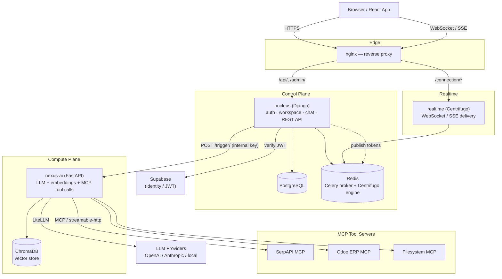

# NeuralOps Nexus — System & Module Architecture

This document explains how the system is put together, and — for each module — *why* that particular tool was chosen over the obvious alternatives. It's meant to be read alongside `readme.md` (how to run it) and `DECISIONS.md` (specific product/implementation rules).

---

## 1. System overview

**Two planes, deliberately separated:**

- **Control plane (`nucleus`)** owns all persistent state — companies, projects, permissions, messages, encrypted model credentials. It is the single source of truth and the only thing with direct database access to app data.
- **Compute plane (`nexus-ai`)** is stateless. It never touches Postgres. Every request carries everything it needs (persona config, decrypted API key, history, context sources) from `nucleus` via the internal API. This means `nexus-ai` can be scaled horizontally, restarted, or swapped out without any data-migration concern — it holds nothing between requests except an in-memory ChromaDB client and embedding model.

This split is why `nucleus` is Django (a framework built around being the source of truth for a relational domain model) and `nexus-ai` is FastAPI (a framework built for being a fast, async, largely stateless request handler).

---

## 2. Module breakdown

### 2.1 `nucleus` — Orchestrator

**Stack:** Django + Django Ninja (async views), PostgreSQL via `asyncpg`.

**Why Django, not another FastAPI service:** everything this module does is fundamentally CRUD over a relational domain with real permission hierarchy — companies → projects → channels → topics → members, each with role-based access (`Owner`/`Admin`/`Member`/`Viewer` groups, see `create_owner.py`). Django gives this for close to free: the ORM, migrations, the built-in `django.contrib.auth` permission system (`user.has_perm("nucleus.add_project")` is used throughout `workspace/api.py`), and the admin site for direct data inspection during development. Rebuilding permission groups, migrations, and an admin UI on top of a leaner framework would be reinventing a large chunk of Django for no benefit, since none of this module's endpoints are latency-critical in the way `nexus-ai`'s streaming is.

**Why Django Ninja specifically (not DRF or plain Django views):** Ninja gives Pydantic-style request/response schemas and OpenAPI generation with much less boilerplate than DRF serializers, and — critically — supports `async def` views natively. That matters here: `chat/api.py`'s `send_message` is async so it can fire Centrifugo publish, nexus-ai embedding, and AI triggering as concurrent `asyncio.create_task()` calls and return to the client immediately, instead of blocking on any of them.

### 2.2 `nexus-ai` — AI Worker

**Stack:** FastAPI, LiteLLM, pydantic-ai (as an MCP client only — see below), FastEmbed, ChromaDB client.

**Why FastAPI:** this service's entire job is streaming — `POST /api/v1/trigger/` returns a `StreamingResponse` of Server-Sent Events as the LLM generates tokens. FastAPI's native async support and first-class `StreamingResponse` make that straightforward; it also has no ORM or admin overhead to carry around for a service that's intentionally stateless.

**Why LiteLLM for every model call:** rather than writing separate integration code per provider (OpenAI SDK, Anthropic SDK, an Ollama client...), every model is addressed by a single LiteLLM-prefixed string — `anthropic/claude-haiku-4-5-20251001`, `openai/gpt-4o`, `ollama/llama3`. Swapping or adding a provider is a config change (`LLM_MODEL` env var, or the `model_id` field on an `AIModel` record), not a code change. `_build_litellm_kwargs()` in `pydantic_ai_runner.py` is the one place model calls are actually built, for both the plain-LLM fast path and the MCP tool-calling loop.

**Why pydantic-ai is used only as an MCP client, not as the agent framework:** it was originally brought in to be the whole agent orchestration layer, but pydantic-ai 2.x removed `LiteLLMModel` and turned `LiteLLMProvider` into a proxy-only client that needs an external LiteLLM server — incompatible with the in-process routing this system relies on. Rather than standing up a separate LiteLLM proxy just to satisfy that dependency, `_run_with_mcp()` uses pydantic-ai's `FastMCPClient` purely to talk MCP (list tools, call tools) and drives the actual model calls with `litellm.acompletion()` directly — the same code path as the non-tool fast path. This is recorded as a hard rule in `DECISIONS.md` §19 because it looks like the "obvious" pydantic-ai `Agent` class should be used here, and reintroducing it would silently break tool calling again.

**Why everything is behind a factory + interface (`interfaces/`, `factories/`):** the agent backend, LLM, embedding provider, and vector store are all swappable via a single env var each (`AGENT_BACKEND`, `LLM_PROVIDER`, `EMBEDDING_PROVIDER`, `VECTOR_STORE` — see `core/config.py`). `EmbeddingFactory.get()` and friends return an implementation of a small interface (`apps/interfaces/embedding.py` etc.), so nothing else in the codebase depends on a concrete provider. This is what makes it possible to run fully offline (FastEmbed + local Ollama) or fully hosted (OpenAI embeddings + Anthropic completions) without touching business logic.

**Why FastEmbed is the default embedding provider:** it runs a local ONNX model inside the `nexus-ai` container — no network call, no API cost, no external dependency for the most latency-sensitive path (every chat message gets embedded). `EMBEDDING_PROVIDER=litellm` is available for teams who'd rather route embeddings through a hosted or self-hosted model server instead.

### 2.3 `realtime` — Centrifugo

**Why Centrifugo instead of a hand-rolled WebSocket server:** message delivery needs to fan out to every connected browser in a topic the moment `nucleus` saves a message — including token-by-token streaming for AI responses (`message_start` / `message_delta` / `message_done` events published in `chat_services.py`). Writing and operating a WebSocket server that handles reconnects, channel subscriptions, and horizontal scaling correctly is a significant undertaking; Centrifugo is a mature, production-grade pub/sub server that does exactly this out of the box, with an HTTP publish API (`POST {CENTRIFUGO_API_URL}/publish`) that `nucleus` calls fire-and-forget. It also natively supports an SSE fallback (`/connection/sse` in `nginx.conf`) for clients where WebSocket is blocked, without any extra application code.

**Why Redis as its engine:** Centrifugo needs a broker to coordinate across multiple instances and persist channel state; Redis is its most common and best-supported engine, and — since `nucleus`'s Celery workers already need Redis as a broker — this reuses infrastructure rather than adding a second message broker for one component.

### 2.4 `nginx` — Reverse proxy

**Why a proxy at all, rather than exposing each service's port directly:** it gives the browser exactly one origin to talk to (`/api/` → nucleus, `/connection/*` → Centrifugo), which sidesteps CORS entirely and gives a single place to terminate TLS in production (or hand off to Tailscale Funnel, see `readme.md` §3). It's also the trust boundary for the Centrifugo origin check — `nexus-transport` has no config flag for allowed origins, so `nginx.conf` deliberately strips the `Origin` header before proxying to `/connection/websocket`, which is documented inline in the config as the reason that specific line exists.

### 2.5 `postgres` — Relational store

**Why relational, not something document-oriented:** the domain here is inherently relational and permission-heavy — companies own projects, projects own channels and topics, users and personas hold roles per project, invitations reference tokens and expiries. Django's migration system and `has_perm()` permission checks assume a relational backend, and the referential integrity (e.g. you cannot have a `ChatMessage` pointing at a deleted `Topic`) is exactly the kind of constraint a relational database enforces for free.

### 2.6 `chromadb` — Vector store

**Why ChromaDB specifically:** it's simple to self-host as a single container with no separate cluster to operate, and it's what backs both context-source search (uploaded files/URLs, `ContextSource.collection_id`) and full chat-history semantic search (`company_{id}_chat` collection, built in `_build_context_sources()`). Like the embedding provider, it sits behind `VECTOR_STORE`/`VectorStoreFactory` so a team that outgrows it can switch to Qdrant or pgvector by implementing one interface, not by rewriting the retrieval logic.

### 2.7 `redis` — Shared infrastructure

Dual-purpose by design: Celery broker for `nucleus`'s background tasks, and the engine Centrifugo uses for cross-instance pub/sub. One piece of infrastructure serving two otherwise-unrelated needs, rather than running two separate brokers.

### 2.8 `neuralops-react-app` — Web client

**Stack:** TanStack Start (SSR) + TanStack Router + React 19.

**Why TanStack Start over plain Vite/CRA or Next.js:** the app needs file-based routing (`src/routes/`), an SSR entry it can control directly for error handling (`src/server.ts` is described in `vite.config.ts` as "our SSR error wrapper"), and to stay React-only without adopting a full Next.js-specific deployment model — since this same codebase is deployed two ways: as a Docker Compose service for self-hosted/local use, and standalone to Vercel for the hosted frontend. TanStack Start is portable across both without framework-specific hosting lock-in.

**Why it talks to the backend over a configurable `NEURALOPS_SERVER_URL`, not a hardcoded API base:** this is what makes "one frontend, many backends" work — the same Vercel-hosted app can connect to anyone's self-hosted `nucleus`, verified via `GET /api/v1/auth/verify/` on connect. See `readme.md` §3 for the two ways to expose a server for this.

### 2.9 `mcps/` — First-party MCP tool servers

**Stack:** FastMCP (Python), Model Context Protocol over streamable-http.

**Why MCP as the tool-integration standard, instead of bespoke function-calling per tool:** MCP decouples "what tools exist" from "what AI worker calls them." A tool server (SerpAPI shopping, Odoo ERP, filesystem) just needs to speak the MCP JSON-RPC protocol over HTTP; `nexus-ai` discovers its tools via `list_tools()` and calls them via `call_tool()` — the same `FastMCPClient` code path regardless of which tool server it's talking to, or what language that server is written in. Adding a new tool server to a persona is a config change (register it via `/add-mcp`, attach it to an agent), not new code in `nexus-ai`.

**Why FastMCP for building the servers themselves:** it turns any `async def` into an MCP tool with `@mcp.tool()`, generating the schema from the function signature and docstring. Writing the equivalent by hand against the raw MCP SDK is materially more boilerplate for the same result — noticeable across three servers (`serp/`, `odoo/`, `filesystem/`) that would otherwise duplicate transport/session handling.

**Why the filesystem MCP uses the official `@modelcontextprotocol/server-filesystem` (via `supergateway`) instead of a custom Python one:** it's the reference implementation, already hardened for path traversal and read-only mounting; wrapping it with `supergateway` to expose it over streamable-http was less risk than re-implementing safe filesystem access from scratch.

### 2.10 Supabase — Identity (external)

**Why an external identity provider instead of a homegrown auth system:** NeuralOps needed JWT-based auth, email/password sign-in, and a hosted account system fast, without maintaining password hashing, reset flows, or session infrastructure itself. `nucleus` never stores passwords — it verifies Supabase-issued JWTs (`authn/auth.py` → `SupabaseBearer`) and maps the verified identity onto its own `User`/`CompanyAccess` model. This keeps identity and workspace-membership as separate concerns: Supabase says *who you are*, `nucleus` decides *what you can do here*.

---

## 3. Cross-cutting decisions

**Internal API key, not full OAuth, between `nucleus` and `nexus-ai`.** These two services trust each other completely — they're not exposed to end users — so `internal/api.py` and `nexus-ai`'s routers authenticate each other with a single shared secret header (`X-Internal-API-Key` / `X-Internal-Key`) rather than a token exchange. Simpler, and appropriate for a boundary between two services you deploy together.

**Fire-and-forget everywhere on the hot path.** `send_message()` in `chat/api.py` saves the message, then spins off Centrifugo publish, nexus-ai embedding, and AI triggering as separate `asyncio.create_task()` calls and returns immediately. The user sees their own message land instantly; everything else — including the AI's reply — streams in over the WebSocket connection they already have open, rather than making them wait on a synchronous request.

**API keys are encrypted at rest, decrypted only at the last moment.** `AIModel.api_key_encrypted` (via `FIELD_ENCRYPTION_KEY`) is only decrypted inside `internal/api.py`'s `get_persona_internal()`, and only sent over the internal network to `nexus-ai` for the duration of a single trigger. It's never persisted in `nexus-ai`, never logged, and never returned to the frontend (`AIModelOut.has_api_key` is a boolean, not the key itself).

**Soft-delete, never hard-delete.** Every model inherits `BaseModel.soft_delete()` (`is_active = False`). This preserves referential integrity for historical chat messages and audit logs — a deleted persona's old messages still render correctly — at the cost of needing explicit `is_active=True` filtering everywhere, and unique-constraint workarounds on recreation (see `DECISIONS.md` §2, §7).

---

## 4. Worked example: what happens on `@Layla show me sales @chart`

1. Browser → `nginx` → `nucleus`: `POST /api/v1/projects/{p}/channels/{c}/topics/{t}/messages/`.
2. `nucleus` saves the message, kicks off three concurrent tasks, and returns immediately:
   - publish the raw message to Centrifugo (`topic-{id}` channel)
   - embed the message into ChromaDB via `nexus-ai`
   - parse `@Layla` (mention) and `@chart` (output type directive)
3. For the mentioned persona, `nucleus` pre-creates a `PENDING` AI message, publishes `message_start`, then opens a streaming `POST /api/v1/trigger/` to `nexus-ai` with the persona's decrypted model config, MCP servers, chat history, and context sources.
4. `nexus-ai` runs the LiteLLM completion (looping through MCP tool calls first if the persona is agent-backed), streaming `message_delta` events back over SSE.
5. `nucleus` relays each delta to Centrifugo as it arrives — the browser renders tokens live.
6. On `message_done`, `nucleus` updates the DB message with the final content + resolved `render_as` (here, `html`, since `@chart` renders as a Chart.js HTML block), publishes `message_done`, and embeds the response for future semantic search.

Every module above exists somewhere in this one round trip — which is why the two-plane split, the internal API boundary, and the fire-and-forget pattern were the first three decisions made.
